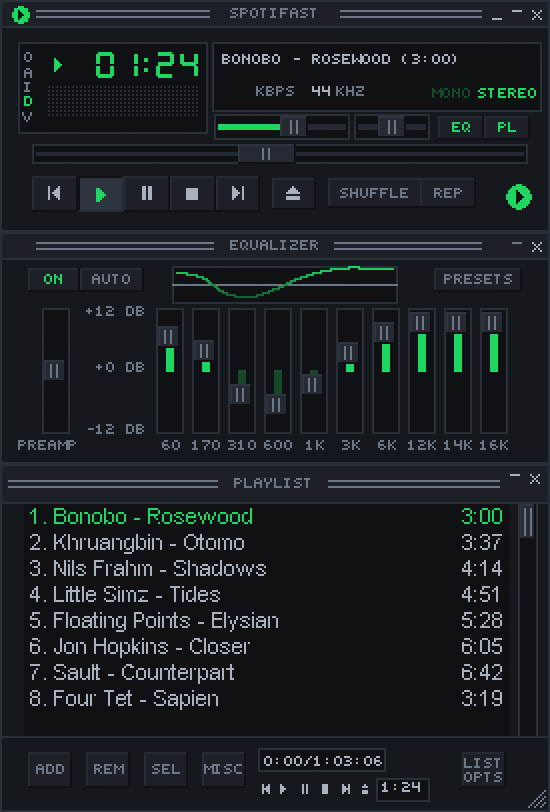

# Fastpotify

**Spotify, native and fast.** Fastpotify is a Spotify client written in
Rust with [egui](https://github.com/emilk/egui). It plays music through
[librespot](https://github.com/librespot-org/librespot). It typically uses
100–250 MB of RAM, while Spotify's desktop app often uses 600 MB to over 1 GB.
It runs on Linux, macOS, and Windows, starts in well under a second, and has no
browser engine.

**Playback needs Spotify Premium.** Free accounts can browse and search, but
cannot play music through Fastpotify on this computer or another device.


See [fastpotify.rocks](https://fastpotify.rocks/) for installation, setup,
everyday use, and connection details.

## About this fork

This is a fork of **[crmne/fastpotify](https://github.com/crmne/fastpotify)**.

**Everything the app does as a Spotify client is the upstream project's
work**, and its documentation is the authority on all of it: installation,
sign-in, the library and search, the queue, playlists and playlist editing,
Home and artist pages, Spotify Connect device control, mDNS speaker discovery,
the Winamp mini player and MilkDrop, the equaliser, MPRIS and the command-line
verbs, settings, packaging, and the release process. None of that is described
again here. Read the upstream README for it.

What this fork adds is **automix**: automatic, beat-matched transitions between
tracks. Upstream plays gaplessly and can crossfade on a fixed timer; this fork
decides *where* a transition belongs and *how* the two tracks fit together,
which is a different and much larger piece of work. See
[Automix](#automix) below.

The fork also carries a patched librespot, because the transitions need
machinery the released library does not have. That is
[Cinnamobot/librespot](https://github.com/Cinnamobot/librespot), branch
`fastpotify-automix`, pinned by revision in `Cargo.lock`. See
[The librespot fork](#the-librespot-fork).

| | Upstream | This fork |
|---|---|---|
| Spotify client features | **all of it** | unchanged, from upstream |
| Crossfade | none | planned, beat-matched |
| Transition length | — | whole bars of the actual tempo |
| Tempo matching | — | the pair is stretched together |
| Next track's entry point | — | where its own music begins |
| Transition display | — | drawn on the progress bar |

Everything in the right-hand column is new here. Upstream has no crossfade at
all: tracks are gapless, and the next one starts at its own first sample.

Not affiliated with Spotify. This fork is independent of the upstream project;
the `upstream` git remote is `crmne/fastpotify`, and everything not under
[Automix](#automix) comes from it.

## What it does

- **Plays music on this computer.** Fastpotify appears as a Spotify Connect
  device. Select it from your phone or play music in the app. Playback is
  gapless and supports up to 320 kbps, with
  optional volume normalisation and an on-disk audio cache.
  Stalled Spotify connections time out after five seconds per attempt so
  playback can try another endpoint.
- **Controls other devices.** Move playback to a speaker, a phone, or
  another computer from the device picker, and keep controlling it: play,
  pause, skip, seek, shuffle, repeat, volume. Long device lists scroll.
- **Finds speakers on your network.** Fastpotify finds librespot, spotifyd,
  and supported hardware receivers over mDNS. Once connected, they appear as
  Spotify Connect devices. The picker uses responding receivers' names and
  combines entries with the same device ID.
- **Library.** Browse playlists, Liked Songs, saved albums, followed artists,
  podcasts, and saved episodes. Filter, pin, and reorder sidebar items.
  On `main`, after 0.7.1, double-click a playlist in Library to start playback;
  a single click opens it.
  Settings offers a compact track list with one line per song and spaced
  separators between its name, artists and added date.
  On `main`, after 0.7.1, choose name, recent plays, or saved-date order where
  available. Follow Spotify’s playlist order or keep a separate local arrangement.
  Move Liked Songs among your pins or unpin it and choose its local position;
  the placement survives restarts.
  With local playback enabled, releases that the Web API groups as singles
  are labelled EP when librespot confirms that type.
  Liked Songs reopens from an account-specific metadata cache. Older rows
  refresh in the background while Like and Unlike take effect immediately.
  Right-click album, artist, and podcast cards for their actions (on `main`,
  after 0.7.1).
- **Search** across songs, artists, albums, playlists, podcasts, and episodes,
  with a top result and per-type views. Right-click results and cards for their actions.
  Text fields offer Cut, Copy, Paste and Select all from their right-click menu.
  On `main`, after 0.7.1, a personal app searches the catalogue while shared
  access finds playlists. Each part appears independently, even if the other fails.

  On `main`, after 0.7.1, the search field stays clear of the device and update
  badges in narrow windows; hover their icons to read the labels.
- **Home** with Made for you, Recently played, your top artists and songs, and
  recommendations. Right-click playlist shortcuts and shelf cards for their actions.
- **Artist pages** with popular songs, a filterable discography, and related
  artists. **Album**, **playlist**, and **podcast** pages support playback
  from any row.
  Discography and related-artist cards also have right-click menus (on `main`,
  after 0.7.1).
  Artist names in the player bar open their pages, including during local
  playback before Web API metadata arrives (on `main`, after 0.7.1).
- **Edit your playlists.** Create, rename, describe, reorder, and delete them.
  On `main`, after 0.7.1, hold a dragged song near the playlist's top or bottom
  edge to scroll to rows beyond the screen. The Library sidebar scrolls while
  dragging toward offscreen playlists too.
  Add songs from a row menu, or drag a row or the currently playing song to a
  playlist in the sidebar. On `main`, after 0.7.1, drop a song from the player
  bar, queue, or another list between rows of an open editable playlist to
  insert it there. This adds a copy and leaves playback and the queue unchanged.
  Clear the playlist’s filter and sort to choose an insertion position.
  Drop it on an empty playlist to add its first song.
  A playlist a friend shared with you takes songs too,
  as Spotify's own apps allow. Filter the **Add to playlist** menu by name to
  find the destination quickly.
- **Opens Spotify links.** Fastpotify registers for `spotify:` links, so a
  song, album, artist, playlist, or podcast shared from another app opens
  in it, whether it is running or not. `open.spotify.com` addresses go
  through the browser, which hands them to the same handler.
- **Queue** as a side panel or a page; it names what is playing from, and
  anything can be added to it from a row menu. **Add to queue** places songs
  after those already queued and before the context continues.
- On `main`, after 0.7.1, a playlist's **Play** button explicitly starts at
  its first available song when Shuffle is off and the original order is
  selected. Double-click a row to start there; use the player bar to resume.
- **Resumes the last session.** On startup, the last song is paused where it
  stopped. Play resumes it, and the other playback controls work before it
  starts.
- **Album-art colour.** Pages and the player bar take a tint from the cover
  of what you are looking at or listening to. Turn it off in Settings.
- **Light and dark**, or follow the system.
- **Winamp mini player.** `Ctrl+M` opens a small player for classic `.wsz`
  skins, drawn at 1x to 4x scale. It includes a spectrum analyser, playlist,
  and equalizer. It keeps its shade mode and, where the desktop permits,
  its own position when switching views. Drop a skin from the
  [Winamp Skin Museum](https://skins.webamp.org) on either window to add it.
  On Windows, after 0.7.1, a mini player saved on a disconnected monitor
  starts at a default position on the current desktop.
  Clicking or double-clicking the Windows tray icon brings the window forward;
  the tray menu still offers Show or hide.
  On Windows, after 0.7.1, hide its taskbar button from Settings or the mini
  player's options menu while keeping the window and tray controls available.
  On Wayland, use the desktop's Keep Above shortcut or rule; the app's
  Always on top controls are unavailable there.

  
- **Equalizer.** Winamp's ten bands and presets over the music played on
  this computer, in Settings and in the skin.
- **MilkDrop.** The visualiser, powered by
  [projectM](https://github.com/projectM-visualizer/projectm), runs in its own
  window and process. It supports fullscreen and automatically downloads more
  than 10,000 `.milk` presets on first use (about 26 MB).

  https://github.com/user-attachments/assets/12b31312-0e0c-4b34-9383-e8c66aabc58d
- **Keyboard-first.** Every common action has a shortcut (`Ctrl+/` or `?` lists
  them).
- **Keeps playing when you close the window.** Fastpotify stays in the system
  tray. Use the tray icon or media controls to reopen it, and quit from the
  tray menu or with `Ctrl+Q`. You can make the close button quit in Settings.
  On macOS, the Dock icon also reopens the window.
- **Visible network activity.** Pages show a spinner while loading. The top
  bar also shows slow or rate-limited Spotify requests.
- **One instance.** Launching it again brings the existing window forward
  instead of starting a second copy, on every platform.
- **Desktop integration.** MPRIS on Linux, so media keys, the shell, and
  `playerctl` see Fastpotify like any other player. On macOS and Windows,
  `fastpotify next` and its siblings drive the running app from a terminal,
  a launcher, or a hotkey. On Windows, after 0.7.1, hover the taskbar button
  for Previous, Play/Pause, and Next under the window preview.

## Automix

Automix decides where one track should hand over to the next, and makes the
join sound intentional rather than accidental. Upstream has no crossfade at
all: playback is gapless, and the next track simply begins at its own first
sample, whatever the music is doing. The join is audible. A fade that starts
mid-phrase over a track whose tempo does not match, with the next song's intro
playing under it, sounds like two songs playing at once.

**The base crossfade itself is not ours.** It is a cherry-pick of
[librespot-org/librespot#1756](https://github.com/librespot-org/librespot/pull/1756),
"feat(playback): crossfade between tracks" by
[@revolutionxk](https://github.com/revolutionxk), still open upstream. That PR
contributes the second decoder, the equal-power ramp, the mixing before the
sink, and `PlayerConfig::crossfade`. Automix builds on it: everything that
decides *where* and *how* the two tracks meet is this fork's work, and the
upstream PR remains the right place to discuss the crossfade mechanism itself.

Automix instead answers four questions about each boundary:

1. **Where does the outgoing track leave?** On a downbeat, after a chorus,
   where the track still has material to fade out of.
2. **Where does the incoming track begin?** Not at its first sample, but where
   its own music starts — past the intro.
3. **How long is the overlap?** A whole number of bars at the track's actual
   tempo, not a fixed number of seconds.
4. **Do the two tempos agree?** If not, both decks are stretched onto a shared
   tempo so the beats line up.

Turn it on with **Settings → Crossfade**, anywhere from 1 to 12 seconds. It is
off at 0, which is the default. The slider sets the *longest* overlap automix
may use; the planner picks a shorter one when the music calls for it and falls
back to a plain crossfade when it cannot plan at all.

### Where the answer comes from

The official Spotify client does not detect transition points by listening.
It asks its servers: `spclient` publishes per-track beats, cuepoints, and a
per-pair recipe with the tempo ratio and bar counts to overlap. That extension
is real and still served — `ExtensionKind::CUEPOINTS`, number 28, carrying
`spotify.automix.proto.Cuepoints`, which holds a fade-in cuepoint and a
fade-out cuepoint with a position and the tempo each was measured at.

The protocol message is not public, but it is self-describing enough to read:
the workspace already carried `protocol/proto/cuepoints.proto`, and
`src/automix_cuepoints.rs` parses it. **Measured across this project's own play
history, the service answers for 57 of 60 tracks**, and the tempo it reports
agrees with our own beat tracker to within 0.1% on all but two, which differ by
exactly an octave.

Using the server's answer is not a shortcut around the hard part — it is the
correct source. Those cues are what the official client's own transitions are
placed against, so a plan built from them lines up with what the service
intends, and the tempo is the one the cues were measured at. Mixing at any
other tempo would put the beats back out of line.

### The local analysis, and why it is the fallback

For the tracks the service has nothing for, the app derives the same thing
from the audio. `src/automix.rs` turns interleaved PCM into a beat grid with
downbeats, finds sections by tracking how the top frequency band rises against
the middle one, and pairs two grids into a transition.

Measurement is what settled the ordering. Run over real material, the local
detector found a usable section on **three of twenty** tracks from a whole
track, and on **none of them** from the 90-second probe the incoming side
actually has. The server's answer is therefore preferred wherever it exists,
and the local analysis covers the rest — currently about 5% of tracks. It
remains the path that runs when playback has no session to ask.

### Making the join musical

**Tempo.** The ratio between two tracks is folded to the nearest power of two
within two octaves, because the same groove at half or double speed is the same
groove. Folding means no pair has to be refused on tempo: the worst case inside
the fold's reach is a gap of one third, and both decks share it rather than one
carrying all of it — a pair 26% apart would otherwise be stretched 26% on a
single deck, past the point where keylock stays clean.

**Length.** Whole bars, longest first (4, then 8, then 2), so slow tracks where
4 bars would fall under the 1.5-second floor still get a longer one. The
overlap is capped at 12 seconds, which is the ceiling the official clients use.
When the server's cue leaves less room than a bar needs, the room itself is
used rather than giving up: the outgoing track has to be fading for as long as
it has, and a shorter overlap is still a mix.

**The incoming deck's half.** The stretch is rendered *ahead* of the boundary
and played as a curve, rather than run live. A deck fed whole packets while it
consumes them at a swept rate either underruns or runs its decoder ahead of what
has been heard, and the only loop that could feed it is the one reporting the
track's position.

**Bass.** Two tracks overlapping share their bass, and bass is where the mud is.
A shelf at 200 Hz moves the low end from one deck to the other across the
overlap, so only one of them owns it at a time.

**Manual skips.** Skip to the next track while a transition is armed and the
incoming track starts where its plan says its music begins, instead of playing
its intro. The plan names the track it is a transition *into*, and the position
is only applied when that name matches what is actually being loaded — a
position is a position in one particular track, so applying it to a different
one would seek nowhere near the music.

### Seeing it

The progress bar draws the coming transition. The exit is a point in the track
being played, so it is marked on the bar itself, with the overlap drawn as a
band reaching to the end of the fade. The arrival is a point in the **next**
track, so it cannot go on the seek bar — pointing at a pixel there would name a
moment of one track with a number belonging to another. It is drawn in a lane
under the bar, on the same seconds scale, so its position reads back as its
value, and that lane is what says which track the number belongs to.

Both marks are labelled with their own seconds, because one pixel is several
seconds of track and a number says what a position cannot. The service's own
cues are drawn in a second colour where the plan has not already put a mark at
that value, and a plan that fell back to the local analysis is drawn dimmer,
since in the numbers the two are identical.

Each track also logs one line as its plan is armed, naming both cues, what the
plan made of them, and whether they came from the server or the local analysis:

```
automix transition track=spotify:track:0IaeDUPwt7JGGSKBdVF49Q at  11.09s | cuepoints: playing [in   10.81s out  262.58s   92.00 BPM] incoming [in   20.73s out  253.46s   98.99 BPM] | plan: exit    --    arrival    --    overlap    --    ratio 1.0000 | source none
automix transition track=spotify:track:0IaeDUPwt7JGGSKBdVF49Q at  11.98s | cuepoints: playing [in   10.81s out  262.58s   92.00 BPM] incoming [in   20.73s out  253.46s   98.99 BPM] | plan: exit  262.58s arrival   20.73s overlap   10.44s ratio 1.0760 | source server
```

`source` is `server`, `local`, or `none`, so a log reads as one line per track
and shows which path placed the edges. The two lines are the same track one
second apart: the first has both cues but no plan, because the incoming side
had not landed yet, and the second is the plan built from them. `--verbose`
adds the fetch and matching decisions behind it.

### It has to survive real listening

Automix runs for hours, so the failure modes that matter are the ones that only
appear after a few hundred tracks. Each of these was found in a real session,
measured, and fixed with a test that fails without the fix:

- Every track after the first was planned against the first one's grid — the
  analysis worker kept the finished result of the track that had ended, and a
  watermark that only rose meant the new track's structure was never re-read.
- A transition stopped firing because the queue's *delimiter marker* was taken
  for the next track. `spotify:delimiter` parses as no track at all, so the
  preload ask was spent and the boundary had nothing to mix in. Measured with
  the marker at the head of a 51-track queue, the ask went unanswered nine
  times.
- One plan was re-sent **297 times** in a row, because a plan whose cue sits
  past the probe window can never be rendered and the retry had no way to know
  that. The longest burst was three minutes at one send per second.
- Unplugging a headset killed the whole application. A sink that will not start
  pauses the player, which the old code read as a broken state machine and
  answered with `exit(1)`.
- A probe step taken before its bytes had arrived blocked the audio thread on a
  condition variable — measured at a median of 137 ms against a sink holding a
  fraction of that.

### Where it lives

| File | What it holds |
|---|---|
| `src/automix.rs` | Beat grids, sections, tempo folding, transition planning |
| `src/automix_track.rs` | The collecting sink and the analysis worker thread |
| `src/automix_cuepoints.rs` | The server's cuepoints, and why a lookup failed |
| `src/automix_driver.rs` | Turns player events into plans; publishes what the UI draws |
| `src/player.rs` | Fetches cuepoints, arms plans, recovers a broken session |
| `src/ui/player_bar.rs` | The transition marks, and the per-track log line |
| `examples/automix_analyse.rs` | Runs the detector over real tracks, offline |

`cargo test` covers the planning arithmetic, the cuepoint parsing, the failure
paths above, and a headless render of the bar with the lane drawn. Two probes
are kept for looking at real data: `examples/automix_analyse.rs` decodes a real
track and prints what each stage of the detector saw, and
`examples/tuner_probe.rs` asks the service for a track's cuepoints and prints
them. Neither touches your library, playback, or settings. The only files they
write are diagnostic dumps next to the working directory, and only when asked
for: `--dump` on the analyser, and the batch modes of the tuner probe.

## The librespot fork

A transition needs the player to do things the released librespot cannot:
start a track at an offset the host chose, hold an overlap while both decks
play, and report the next track early enough to look something up about it.

This fork therefore builds against
**[Cinnamobot/librespot](https://github.com/Cinnamobot/librespot)**, branch
`fastpotify-automix`, pinned by revision in `Cargo.lock`. All seven librespot
crates come from that branch so one copy exists.

Two kinds of change live there. The small ones are queue controls, a
normalisation-factor report for the visualisers, a distinct event when Spotify
refuses an audio key, a connection deadline that includes socket setup, and an
in-memory credential cache. The large one is the crossfade machinery automix
drives:

- `CrossfadePlan` — where each deck goes, how far the pair is stretched, and
  the track the plan is a transition *into*, so a plan can be checked against
  the boundary it was armed for.
- `PlayerEvent::UpcomingTrack` — the track that will play next, raised as soon
  as the queue knows one, rather than only when the preload needs its *audio*.
- `PlayerEvent::IncomingPreloaded` — the incoming track's probe, which is how
  the local path gets a grid for a track that never reaches the sink.
- A keylocked deck for the outgoing tail, the bass handover, the rendered
  incoming curve, and a preload ask the player repeats while the queue has
  nothing to give it.

Requirements, known limits, and the test suite for upstream librespot are
documented in that project's own README, which this fork does not restate.

## Install

On Arch Linux, Fastpotify is in the AUR:

```bash
yay -S fastpotify-bin      # the released build, ready made
yay -S fastpotify          # the release, built from source
yay -S fastpotify-git      # built from the latest commit
```

On macOS, with [Homebrew](https://brew.sh):

```sh
brew install --cask crmne/tap/fastpotify
```

On Gentoo, [niko-overlays](https://github.com/NikoMalik/niko-overlays) offers
an optional **community-maintained** package. Its current `0.7.1` ebuild
builds post-release snapshot `67b8dfb`, rather than the `v0.7.1` release, and
omits MilkDrop. Use the released binary or build instructions below if you
want the standard release and feature set.

To enable the overlay with `eselect-repository`, run as root:

```sh
emerge --ask app-eselect/eselect-repository
eselect repository add niko-overlays git https://github.com/NikoMalik/niko-overlays.git
emaint sync -r niko-overlays
emerge --ask --autounmask-write media-sound/fastpotify::niko-overlays
```

Review and apply any proposed keyword changes with `dispatch-conf`, then
repeat the final `emerge` command.

Everywhere else, build the single binary with Rust 1.95 or newer:

```bash
cargo install --path . --locked
```

MilkDrop uses libprojectM, which is built from source. This needs CMake, a C++
compiler, and libclang. To build without MilkDrop or those tools, run
`cargo install --path . --locked --no-default-features`. On Linux, you also need the
development packages for ALSA, PulseAudio or PipeWire, and the windowing
libraries. On Arch:

```bash
sudo pacman -S --needed alsa-lib libpulse libxkbcommon wayland cmake clang
```

and on Debian or Ubuntu:

```bash
sudo apt install libasound2-dev libpulse-dev libxkbcommon-dev libwayland-dev \
  cmake clang libclang-dev
```

and on Fedora:

```bash
sudo dnf install alsa-lib-devel pulseaudio-libs-devel libxkbcommon-devel \
  wayland-devel cmake clang libclang-devel
```

On Windows, libprojectM is built with Visual Studio 2022, CMake, LLVM, and
vcpkg (`vcpkg install glew:x64-windows-static`, with
`VCPKG_INSTALLATION_ROOT` pointing at the vcpkg folder).

With [Nix](https://nixos.org), `nix develop` provides all of it, along with
the exact toolchain `rust-toolchain.toml` pins.

On macOS, the flake also exposes `packages.<system>.fastpotify-app`, an
ad-hoc signed `Fastpotify.app` bundle for the Dock, Launch Services, and
`spotify:` links. With nix-darwin, add it to `environment.systemPackages`
and link `"/Applications"` through `environment.pathsToLink`; with Home
Manager, `home.packages` is enough, as its darwin support links the bundle
into `~/Applications`.

Fastpotify uses system fonts for scripts not covered by its interface font,
including Chinese, Japanese, Korean, Arabic, Hebrew, Thai, and Indic scripts.
On macOS it draws each of them with the face the system itself uses, in the
language order set in System Settings, so Chinese titles follow the
Traditional or Simplified preference set there. Windows includes common
fonts. On Linux, install `noto-fonts` and `noto-fonts-cjk` (Arch) or
`fonts-noto` and `fonts-noto-cjk` (Debian or Ubuntu) if titles appear as
empty boxes.

A desktop entry is provided in `packaging/applications/fastpotify.desktop`.
It registers Fastpotify for `spotify:` links; `xdg-mime default
fastpotify.desktop x-scheme-handler/spotify` makes it the one the desktop
uses when another Spotify client is installed too.

## Sign in

Press **Sign in with Spotify**. Your browser opens Spotify's consent page
(Authorization Code with PKCE), so Fastpotify never sees your password. The
app keeps its grants in the system credential store: Secret Service on Linux,
Keychain on macOS, and Credential Manager on Windows. You usually sign in once
per machine. If the store is unavailable or locked, a new sign-in works for
this session and Fastpotify explains that it could not save it.

Playing music **on this computer** needs a second, one-time browser approval.
Spotify handles streaming separately from library access. Start it from the
device menu (**Set up playback here**) or Settings. It needs Spotify
Premium. Its reusable credential uses the same protected storage, independently
of the two Web API grants.

Existing token files migrate after the protected write has been read back
successfully. A failed migration keeps the original for recovery and reports
an error. Sign-out removes shared, personal, and playback grants, including
legacy files and pending writes. Non-secret revocation markers prevent a
failed keychain deletion from silently restoring a signed-out session.
See [credential storage and file locations](docs/_reference/settings-and-files.md).
On `main`, after 0.7.1, Flatpak also preserves its fallback state directory
across full quits, including on older Flatpak versions.

Playback approval requests Spotify's streaming permission separately. A
verified personal app can complete sign-in while the shared app is busy.

The Web API uses a shared app by default. You can add a personal Spotify
Development Mode app in Settings → Account for a separate quota. Fastpotify
still uses the shared app for requests that personal apps do not support.
On `main`, after 0.7.1, Premium listeners using shared access see a one-time
prompt explaining the personal app option, with a button that opens setup.
Dismissal is remembered across restarts.

## Account safety

We are not aware of a Spotify account being suspended for using Fastpotify
or another librespot player with Premium. Sign-in happens on Spotify's own
pages, audio uses the quality included with Premium, DRM stays intact, and
Fastpotify does not rip tracks or block ads.

Reported suspensions usually involve modded apps that remove ads from free
accounts, track ripping, or stream manipulation. Fastpotify does none of
those things, and [CONTRIBUTING.md](CONTRIBUTING.md) prohibits them.

## Keyboard shortcuts

Hold `Shift` while turning the mouse wheel to scroll horizontal shelves,
including Made for you and Recently played on Home.

The main window exposes named playback controls, library and song rows,
menus, sliders, and settings switches to screen readers. Use `Tab` and
`Shift+Tab` to move focus, then `Enter` or `Space` to activate a control or
play a focused song. Left and right arrows adjust a focused volume or seek
slider. Windows testing with NVDA and accessibility for Winamp skins are
still in progress.

| Shortcut | What it does |
| --- | --- |
| `Space` | Play or pause |
| `Ctrl+←` / `Ctrl+→` | Previous or next |
| `Shift+←` / `Shift+→` | Seek 10 seconds |
| `Ctrl+↑` / `Ctrl+↓` | Volume |
| `M` | Mute |
| `B` | Like or unlike the playing song |
| `S` / `R` | Shuffle / cycle repeat |
| `Q` | Queue panel |
| `Ctrl+F` or `/` | Search |
| `Ctrl+B` | Show or hide the sidebar |
| `Alt+←` / `Alt+→` | Back or forward |
| `Ctrl+H` / `Ctrl+L` | Home / Liked Songs |
| `Ctrl+Shift+A` / `Ctrl+Shift+B` | Playing artist / album |
| `Ctrl+M` | Winamp mini player |
| `Ctrl+Shift+K` | MilkDrop |
| `Ctrl+,` | Settings |
| `Ctrl+/` or `?` | All shortcuts |
| `Ctrl+Q` | Quit |

On macOS, `Cmd` replaces `Ctrl`.

## Controlling it from outside

On Linux, Fastpotify is an MPRIS player, so `playerctl --player=fastpotify
play-pause` already works.

macOS and Windows have no such bus, so the same verbs are subcommands. They
talk to the instance already running and print nothing on success:

```
fastpotify play-pause          fastpotify volume 40
fastpotify play                fastpotify volume-up [percent]
fastpotify pause               fastpotify volume-down [percent]
fastpotify next                fastpotify mute
fastpotify previous            fastpotify shuffle [on|off]
fastpotify seek 15             fastpotify repeat [off|context|track]
fastpotify seek -- -15         fastpotify like
fastpotify seek-to 90          fastpotify play-uri spotify:playlist:37i9…
fastpotify show                fastpotify transfer <device-id>
fastpotify now-playing [--raw] fastpotify devices [--raw]
```

`shuffle` and `repeat` toggle when used without an argument. Pass a state to
set it directly. `like` adds or removes the playing track from your library.

`now-playing` prints one readable line. `--raw` prints tab-separated fields:
state, title, artists, album, position_ms, duration_ms, volume, shuffle,
repeat, art_url, saved, and device. `saved` is `yes`, `no`, or `unknown` while
loading. New fields are appended to keep older scripts working.

`devices` lists Spotify Connect devices with the ID first and the active one
marked with `*`. `--raw` prints JSON. The command refreshes the device list,
so the first call after startup may be empty. Run it again if needed.

A verb exits non-zero when Fastpotify is not running.

On every platform, `fastpotify <link>` opens a Spotify link, a `spotify:`
URI or an `open.spotify.com` address, in the running app, or starts the
app on it. This is what the desktop runs when a link is clicked.

Launchers such as Raycast or Alfred can use these commands. The Stream Deck
plugin uses the same interface.

## Settings

Settings live in one readable JSON file (`~/.config/fastpotify/settings.json`
on Linux). They include the Connect device name, bitrate, normalisation,
autoplay, gapless playback, the audio backend (PulseAudio/PipeWire or ALSA on
Linux), audio cache size, theme, sidebar state, whether pages take colour
from artwork, and the mini player's skin and size.
Playback settings apply when you press **Apply and restart playback**.
The Settings page has its own search: type under the title to narrow the
rows, clear the field to see everything again.
You can also check for a new release from Settings. On macOS, the same command
is in the application menu.

On Windows and Linux, update-enabled portable downloads can download a release
in the app, verify its published SHA-256 checksum, and restart to install it.
Windows installer builds use their installer for the replacement. Settings can
enable automatic background downloads; restarting always requires a click.
The update popup opens only when you click the green update pill. Update checks
and automatic downloads leave it closed, and closing it keeps downloads running.
A failed startup restores the previous installation. An interrupted or damaged
download leaves the running app alone. Updates keep your settings and sign-in
files. On macOS, a writable Fastpotify.app downloaded from the release page can
update its whole app bundle from the universal DMG. Move the app out of the disk
image before updating. The updater verifies the app signature and version;
Developer ID builds also require the same signing team and macOS approval.
Keep the app in Applications; macOS can require folder access when it is run
from Documents.

Package-managed installations continue to update through their package manager,
including Homebrew, Flatpak, apt, dnf, pacman, Nix, and Cargo. Unrecognized
installations use the download page. Portable archives identify themselves with
`fastpotify-portable.txt`; older archives need one manual upgrade to an
update-enabled build.

Caches (audio, artwork) live under the cache directory and can be deleted at
any time without signing you out.

## How it is built

- `src/player.rs`: librespot playback, mixing, and Spotify Connect state.
- `src/automix.rs`, `src/automix_track.rs`, `src/automix_cuepoints.rs`,
  `src/automix_driver.rs`: beat grids, transition planning, the collecting
  sink, the server's cuepoints, and the driver that turns player events into
  plans. See [Automix](#automix).
- `src/api/`: shared and personal Web API sessions, routing, concurrency, and
  rate limits.
- `src/backend.rs`: the tokio runtime and channels used by the interface.
- `src/images.rs`: album art loading, caching, and accent-colour extraction.
- `src/app.rs`, `src/model.rs`, `src/ui/`: state, navigation, and views.
- `src/mpris.rs`: Linux media controls.

Fastpotify pins its Rust toolchain in `rust-toolchain.toml`; `cargo test`
covers the API models, dual-session routing, PKCE, the player state machine,
the transition planner and its failure paths, and a headless render of every
page, panel, and dialog.

To look at the interface without a Spotify account, build with the `demo`
feature and start it with sample data:

```bash
cargo run --features demo -- --demo --demo-page playlist:pl1 --demo-show queue
```

Demo mode never writes settings. `--demo-shot <PATH>` writes the window to a
PNG and exits, which is useful for reproducible interface screenshots.
`--demo-size WIDTHxHEIGHT` sets the window size for that shot.

## Contributing

Read [CONTRIBUTING.md](CONTRIBUTING.md) before opening an issue or pull
request. It covers project scope and required checks.

Translations use standard gettext `.po` files in `assets/i18n/`, with an English
`.pot` template. The current pilot translates navigation and Library labels in
12 languages, including Portuguese and Chinese variants, in demo mode; the
production interface remains English. See
[Translating Fastpotify](docs/_reference/translating.md) for editing with existing
translation tools, previewing, and reporting translation problems.

Issues and discussions receive automated triage, including reassessment after
new or edited comments. A rocket on the report or comment means its assessment
completed successfully; it does not promise a reply or a fix. See
[automated triage](CONTRIBUTING.md#automated-triage) for details.

## Acknowledgements

Fastpotify uses [librespot](https://github.com/librespot-org/librespot),
[egui](https://github.com/emilk/egui), the [Inter](https://rsms.me/inter/)
typeface (OFL), and [Lucide](https://lucide.dev) icons (ISC).

Fastpotify is an independent project and is not affiliated with Spotify.
Spotify is a trademark of Spotify AB.

Licensed under the [MIT License](LICENSE).

## Packaging maintenance

Release packaging uses the [native-packages](https://rubygems.org/gems/native-packages) gem. `native-packages.yaml` declares packages and downstream repositories; native recipes and installation assets live in `packaging/`; see [PACKAGING.md](PACKAGING.md) for local commands and CI behavior.
